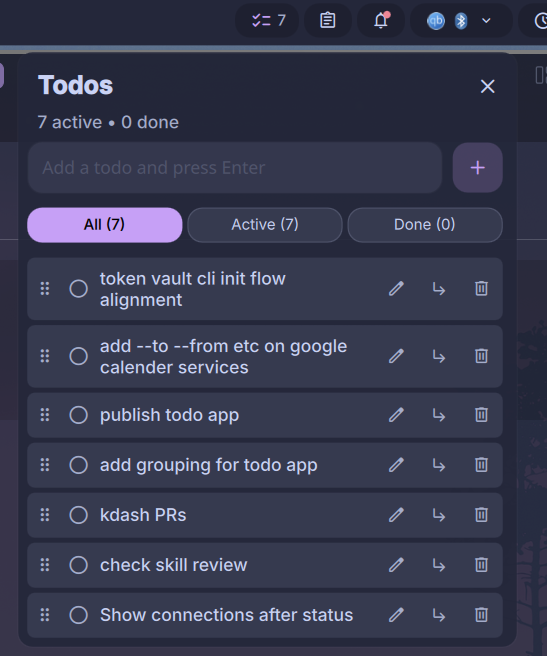

# Dank Todo

A local-first task manager for the [DankMaterialShell](https://github.com/AvengeMedia/DankMaterialShell) bar.



## Features

- Dedicated create/edit page opened from the main list
- Optional multiline task details, kept out of the compact task rows
- Three-state task cycle: not started → in progress → completed
- Per-item delete (cascades to subtasks) and "Clear completed" both soft-delete items in storage
- Unified task page with active tasks first and a collapsed, independently scrollable Completed section below
- Adaptive active-list height that shows roughly 10–13 tasks before scrolling, depending on screen height
- Completed-task filtering for this week, last week, this month, or a custom inclusive date range
- Trash is a separate page with restore, permanent-delete, and empty-trash actions
- Due dates, priorities, and tags with inline editing
- Integrated calendar date picker in the create/edit page
- Dedicated schedule page with week and month views, per-day task counts, and dated task lists
- Optional due times with desktop reminders at the due time or 10 minutes, 1 hour, or 1 day early
- Daily, weekday, weekly, and monthly recurring tasks that retain completed history
- Create a task directly from the selected day in the schedule page
- Quick due-date choices for today, tomorrow, and next Monday
- Persistent manual, due-date, and priority sorting on the main task list
- Search across task text and tags
- **Drag-and-drop reordering and nesting** — drag a task row and drop above, below, or onto another task
- Unlimited nesting depth, with indented display
- Pill count mode — show active, total, done, or hide the badge
- Storage location configurable; defaults to `$XDG_CONFIG_HOME/dank-todo/todos.json`
- Atomic JSON writes, safe against corruption
- IPC commands for scripting and keybindings

## Code structure

- `DankTodoWidget.qml` — plugin entry, persistence, IPC, and page coordination
- `TodoTaskRowV6.qml` — active shared task row with three-state progress, right-click cancellation, compact schedule metadata, and overflow actions (older versions are retained for DMS cache compatibility)
- `CompletedTasksSectionV6.qml` — active completed-task section with time filtering and its independent list (older versions are retained for cache compatibility)
- `TodoCalendarGrid.qml` — reusable month grid for date selection and schedule views
- `TodoUtils.js` — pure date, priority, and tag helpers
- `DankTodoSettings.qml` — plugin settings page

## Installation

### Via DMS GUI

1. Open DMS Settings (`Mod` + `,`)
2. Go to the Plugins tab → Browse → enable third-party plugins
3. Install **Dank Todo**
4. Enable it with the toggle, then add the widget to a bar section

### Via DMS CLI

```bash
dms plugins install dankTodo
```

### Manually

```bash
cd ~/.config/DankMaterialShell/plugins
git clone https://github.com/yyydddkkk/dms-todo dankTodo
```

Then in DMS Settings → Plugins, click "Scan for Plugins" and enable **Dank Todo**.

## Usage

Click the pill in the bar to open the popout. The main page is dedicated to browsing and searching tasks. Click the **+** button beside search to open the separate creation page, enter a title and optional multiline details, date, time, reminder, recurrence, priority, and tags, then save. The schedule page also has a **+** action that preselects the visible date. Left-click a task's state circle once to mark it in progress (a short bar), again to complete it, and again to reset it to not started. Right-click the state circle while it is in progress to cancel progress and return to not started. Use the trash action to delete, or "Clear completed" to move done items to Trash. Deleted tasks can be restored or permanently removed from the Trash view. Search matches titles, details, and tags while keeping details out of the compact list rows.

All-day tasks do not send notifications. Timed tasks can remind at the due time or in advance. After a reminder fires, use **Snooze 10 minutes** in the task menu to postpone it. Completing a recurring task keeps the completed occurrence and creates the next future occurrence on the original cadence.

Expand **Completed** to filter its independent list by the current week, previous week, current month, or a custom inclusive date range. Custom ranges use calendar pickers and initially cover the most recent seven days. Completed tasks are shown newest first; legacy items without a completion timestamp remain available under **All**.

Each row also has edit (`✎`) and subtask (`⤵`) buttons next to delete:

- **Edit** — populates the main input with the row's text and switches to "Editing: …" mode. Enter saves, Escape (or the × on the chip) cancels.
- **Subtask** — switches the main input to "Subtask of: …" mode. Enter adds the new todo as a child of that row, Escape (or ×) cancels.

The two modes are exclusive — triggering one clears the other. The + button on the input turns into a ✓ when editing.

**Reordering and grouping**: in Manual sort mode, drag a non-trash task row to move it:

- Drop in the **top quarter** of a row → insert as a sibling **before** it
- Drop in the **bottom quarter** → insert as a sibling **after** it (after its entire subtree)
- Drop in the **middle** → become a **child** of that row (indented below it)

A blue line marks sibling drops; a tinted background marks child drops. Dropping a todo onto itself or onto one of its own descendants is blocked.

## Settings

- **Storage directory** — override the default `$XDG_CONFIG_HOME/dank-todo` location
- **Bar pill count** — Active / Total / Done / Hidden
- **Maximum todos** — cap the list size (default 200)
- **Maximum characters per todo** — longer entries are truncated (default 500)

## IPC

```bash
dms ipc call dankTodo add "Buy milk"
dms ipc call dankTodo addChild "Whole milk" <parentId>
dms ipc call dankTodo edit <id> "New text"
dms ipc call dankTodo setDescription <id> "Remember lactose-free"
dms ipc call dankTodo setDetails <id> 2026-08-17 high work,urgent
dms ipc call dankTodo setSchedule <id> 2026-08-17 09:00 10 weekly
dms ipc call dankTodo snooze <id>
dms ipc call dankTodo toggle <id>
dms ipc call dankTodo cancelProgress <id>
dms ipc call dankTodo remove <id>
dms ipc call dankTodo restore <id>
dms ipc call dankTodo purge <id>
dms ipc call dankTodo emptyTrash
dms ipc call dankTodo move <sourceId> <targetId> <position>   # position: before | after | child
dms ipc call dankTodo clearDone
dms ipc call dankTodo list       # returns JSON array
dms ipc call dankTodo count      # returns "active/total"
```

Great for binding "add todo from current clipboard" to a key in your compositor.

### Niri keybinding example

```kdl
binds {
    Mod+Shift+T hotkey-overlay-title="Add clipboard to Todo" {
        spawn "sh" "-c" "dms ipc call dankTodo add \"$(wl-paste -n)\"";
    }
}
```

## Data format

Todos are stored as plain JSON. Back it up or sync it however you like:

```json
{
  "version": 4,
  "preferences": {
    "sortMode": "manual"
  },
  "todos": [
    {
      "id": "parent-1",
      "text": "Shopping",
      "description": "Check the weekly list before leaving.",
      "completed": false,
      "inProgress": true,
      "parentId": null,
      "createdAt": "2026-04-22T14:00:00.000Z",
      "dueDate": "2026-04-23",
      "dueTime": "09:00",
      "reminderMinutes": 10,
      "recurrence": "weekly",
      "reminderState": {},
      "priority": "high",
      "tags": ["shopping"]
    },
    {
      "id": "child-1",
      "text": "Buy milk",
      "completed": false,
      "parentId": "parent-1",
      "createdAt": "2026-04-22T14:00:10.000Z"
    }
  ]
}
```

Array order is the manual display order; `parentId: null` means top-level. `inProgress` is only true for the intermediate state and is forced false for completed tasks. Details are optional plain text with preserved line breaks. Due-date and priority sorting affect only the rendered active list and preserve that manual order. Soft-deleted items are retained with `deletedAt`, hidden from normal views and available in Trash. The loader migrates older version 1–3 data automatically; missing status, details, schedule fields, priorities, tags, and preferences receive safe defaults. Reminder state is persisted so plugin reloads do not duplicate notifications.

## Requirements

- DankMaterialShell
- Niri window manager (though the plugin has no compositor-specific code)

## License

MIT
